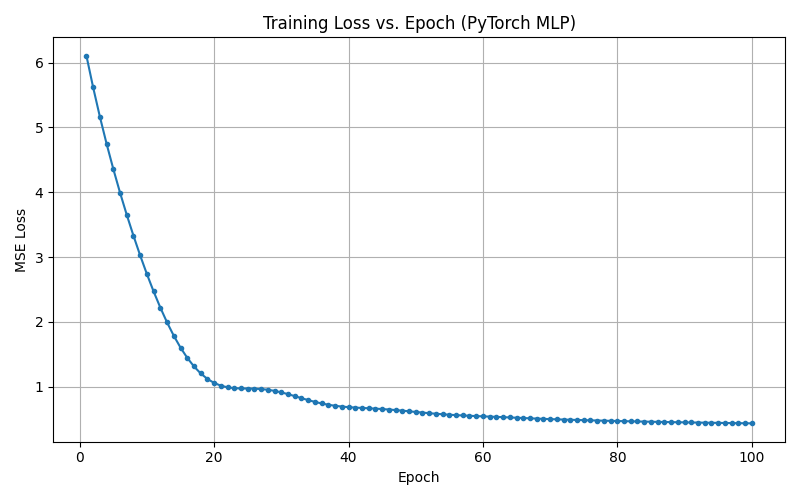

# Assignment 2: California Housing Regression

## How to Run

```bash
conda create -n env_csci4425 python=3.12.2
conda activate env_csci4425
conda install numpy=2.4.1 matplotlib=3.10.8 pandas=2.3.3 scikit-learn=1.8.0
conda install pytorch=2.5.1 torchvision=0.20.1 torchaudio=2.5.1
python hw2.py
```

## Part 1: Data Loading and Exploration

### Dataset Description

```
.. _california_housing_dataset:

California Housing dataset
--------------------------

**Data Set Characteristics:**

:Number of Instances: 20640

:Number of Attributes: 8 numeric, predictive attributes and the target

:Attribute Information:
    - MedInc        median income in block group
    - HouseAge      median house age in block group
    - AveRooms      average number of rooms per household
    - AveBedrms     average number of bedrooms per household
    - Population    block group population
    - AveOccup      average number of household members
    - Latitude      block group latitude
    - Longitude     block group longitude

:Missing Attribute Values: None

This dataset was obtained from the StatLib repository.
https://www.dcc.fc.up.pt/~ltorgo/Regression/cal_housing.html

The target variable is the median house value for California districts,
expressed in hundreds of thousands of dollars ($100,000).

This dataset was derived from the 1990 U.S. census, using one row per census
block group. A block group is the smallest geographical unit for which the U.S.
Census Bureau publishes sample data (a block group typically has a population
of 600 to 3,000 people).

A household is a group of people residing within a home. Since the average
number of rooms and bedrooms in this dataset are provided per household, these
columns may take surprisingly large values for block groups with few households
and many empty houses, such as vacation resorts.

It can be downloaded/loaded using the
:func:`sklearn.datasets.fetch_california_housing` function.

.. rubric:: References

- Pace, R. Kelley and Ronald Barry, Sparse Spatial Autoregressions,
  Statistics and Probability Letters, 33 (1997) 291-297

```

### First 5 Rows

|    |   MedInc |   HouseAge |   AveRooms |   AveBedrms |   Population |   AveOccup |   Latitude |   Longitude |   MedHouseVal |
|---:|---------:|-----------:|-----------:|------------:|-------------:|-----------:|-----------:|------------:|--------------:|
|  0 |   8.3252 |         41 |    6.98413 |     1.02381 |          322 |    2.55556 |      37.88 |     -122.23 |         4.526 |
|  1 |   8.3014 |         21 |    6.23814 |     0.97188 |         2401 |    2.10984 |      37.86 |     -122.22 |         3.585 |
|  2 |   7.2574 |         52 |    8.28814 |     1.07345 |          496 |    2.80226 |      37.85 |     -122.24 |         3.521 |
|  3 |   5.6431 |         52 |    5.81735 |     1.07306 |          558 |    2.54795 |      37.85 |     -122.25 |         3.413 |
|  4 |   3.8462 |         52 |    6.28185 |     1.08108 |          565 |    2.18147 |      37.85 |     -122.25 |         3.422 |

### Summary Statistics

|       |      MedInc |   HouseAge |     AveRooms |    AveBedrms |   Population |     AveOccup |    Latitude |   Longitude |   MedHouseVal |
|:------|------------:|-----------:|-------------:|-------------:|-------------:|-------------:|------------:|------------:|--------------:|
| count | 20640       | 20640      | 20640        | 20640        |     20640    | 20640        | 20640       | 20640       |   20640       |
| mean  |     3.87067 |    28.6395 |     5.429    |     1.09668  |      1425.48 |     3.07066  |    35.6319  |  -119.57    |       2.06856 |
| std   |     1.89982 |    12.5856 |     2.47417  |     0.473911 |      1132.46 |    10.386    |     2.13595 |     2.00353 |       1.15396 |
| min   |     0.4999  |     1      |     0.846154 |     0.333333 |         3    |     0.692308 |    32.54    |  -124.35    |       0.14999 |
| 25%   |     2.5634  |    18      |     4.44072  |     1.00608  |       787    |     2.42974  |    33.93    |  -121.8     |       1.196   |
| 50%   |     3.5348  |    29      |     5.22913  |     1.04878  |      1166    |     2.81812  |    34.26    |  -118.49    |       1.797   |
| 75%   |     4.74325 |    37      |     6.05238  |     1.09953  |      1725    |     3.28226  |    37.71    |  -118.01    |       2.64725 |
| max   |    15.0001  |    52      |   141.909    |    34.0667   |     35682    |  1243.33     |    41.95    |  -114.31    |       5.00001 |

## Part 2: Data Preprocessing

- Train/test split: 80% / 20%, `random_state=0`
- Features scaled with `StandardScaler`, fit on training data only and applied to both train and test sets to avoid data leakage.

## Part 3: Models

- **Model 1:** `LinearRegression` (scikit-learn), trained on scaled training data.
- **Model 2:** PyTorch `MLP` with one hidden layer (32 units, ReLU), trained for 100 epochs with `Adam` (lr=0.01) and `MSELoss`.

## Part 4 & 5: Evaluation and Analysis

### Performance Comparison

| Model | MSE | RMSE | R² |
|---|---|---|---|
| Linear Regression | 0.5290 | 0.7273 | 0.5943 |
| PyTorch MLP | 0.4446 | 0.6668 | 0.6591 |

The PyTorch MLP achieved a lower MSE/RMSE and a higher R2 than the baseline Linear Regression model, This indicates that the nueralnetwork captured more of the non-linear structure in the data andproduced more accurate predictions on the test set.

### Training Loss Curve



The loss decreases during the first several epochs as the model quickly learns the linear relationships in the data, then the rate of decrease slows and the curve flattens as training continues, indicating the model is reaching the max optimization of its weighing.

## AI Use Statement

AI use statement: Generative AI tools were used to assist with portions of this assignment, in accordance with the course's GenAI policy. Claude Sonnet 5 (Anthropic) was used to help structure code for hw2.py, as well as to assist with debugging issues encountered during testing. Gemini 2.5, accessed within Google Colab, was also used to assist with code explanation, debugging,and troubleshooting during development and execution in the Colab environment.All AI-generated content was reviewed, tested, and revised as necessary to ensure it functioned correctly.
